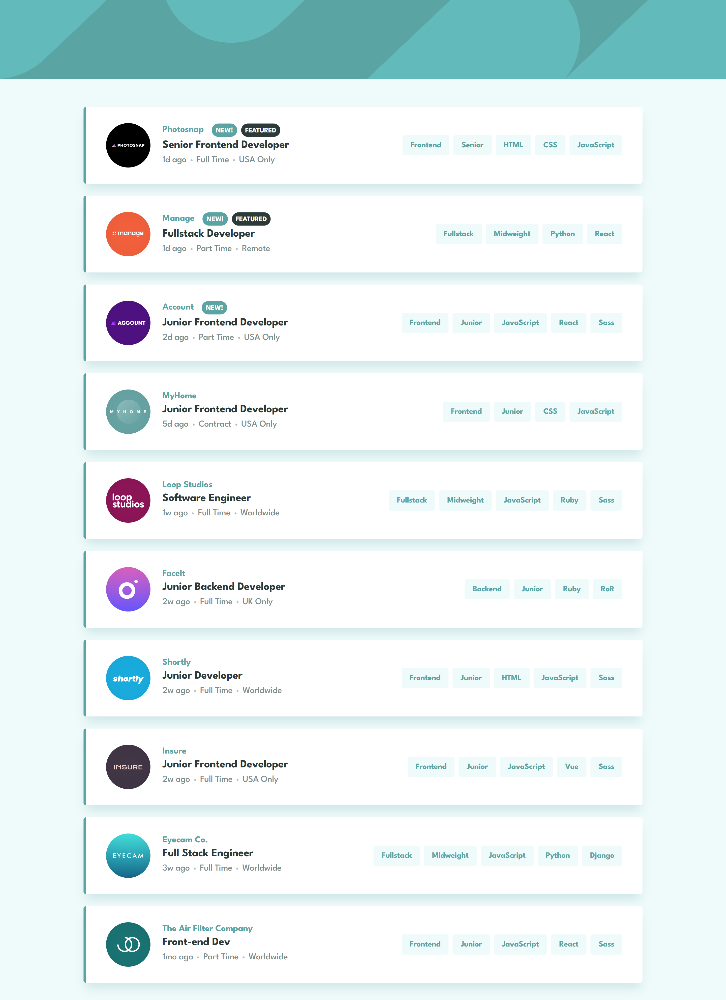
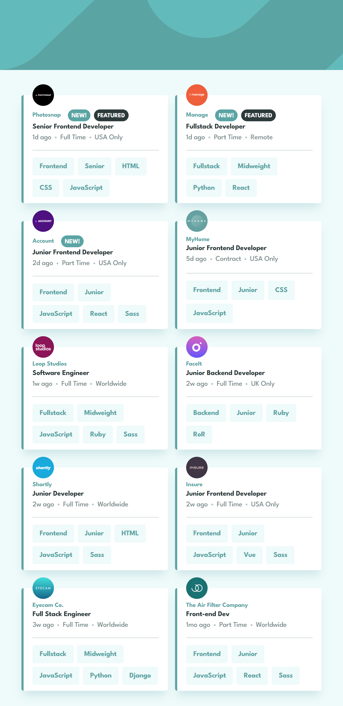
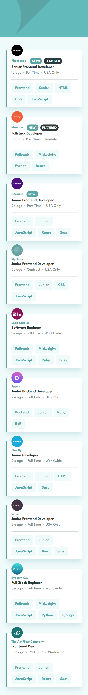
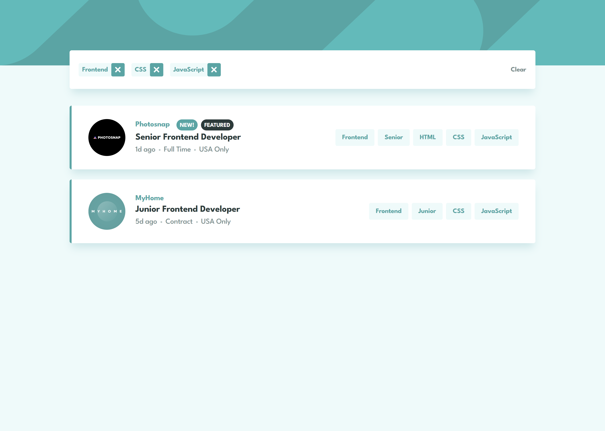
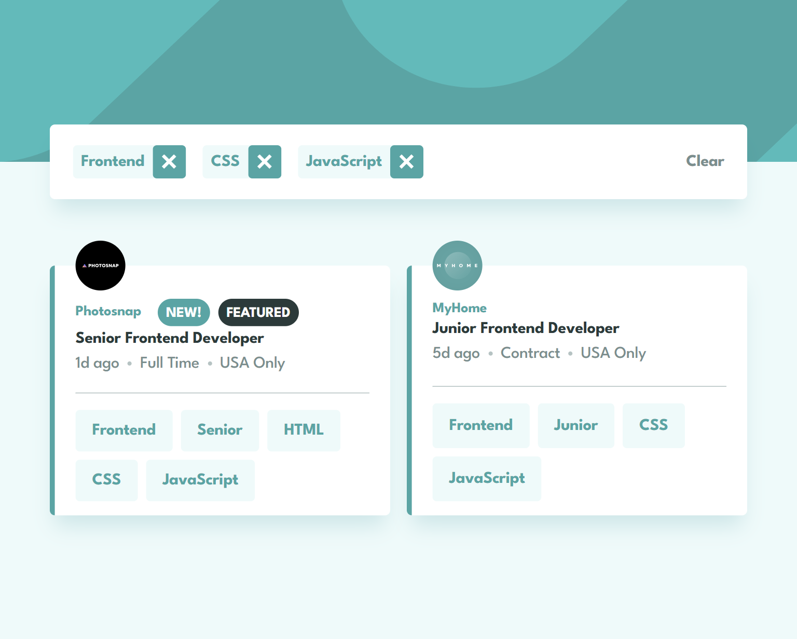
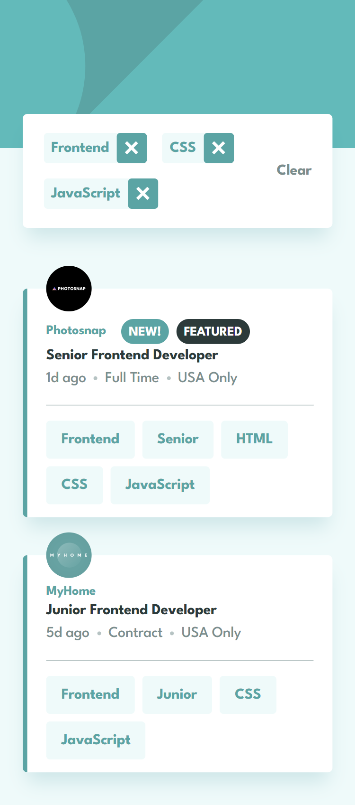

# Frontend Mentor - Job listings with filtering solution

This is a solution to the [Job listings with filtering challenge on Frontend Mentor](https://www.frontendmentor.io/challenges/job-listings-with-filtering-ivstIPCt). Frontend Mentor challenges help you improve your coding skills by building realistic projects.

### The challenge

Users should be able to:

- View the optimal layout for the site depending on their device's screen size
- See hover states for all interactive elements on the page
- Filter job listings based on the categories

### Screenshot

<table>
  <tr>
    <td></td>
    <td></td>
    <td></td>
  </tr>
    <tr>
    <td></td>
    <td></td>
    <td></td>
  </tr>

</table>

### Links

- Solution URL: https://www.frontendmentor.io/solutions/job-listings-with-filtering-gUyYxh-I2Z
- Live Site URL: https://mzdemir-static-job-listings.netlify.app/

### Built with

- Semantic HTML5 markup
- Javascript
- Mobile-first workflow
- Accessibility

## Author

- Website - https://github.com/mzdemir
- Frontend Mentor - https://www.frontendmentor.io/profile/mzdemir
